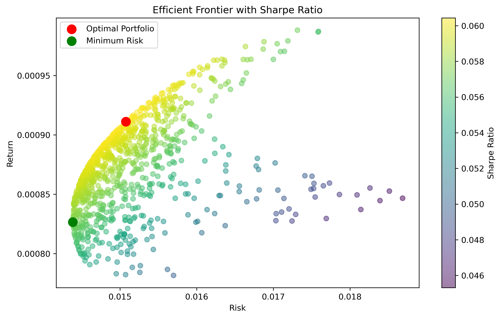
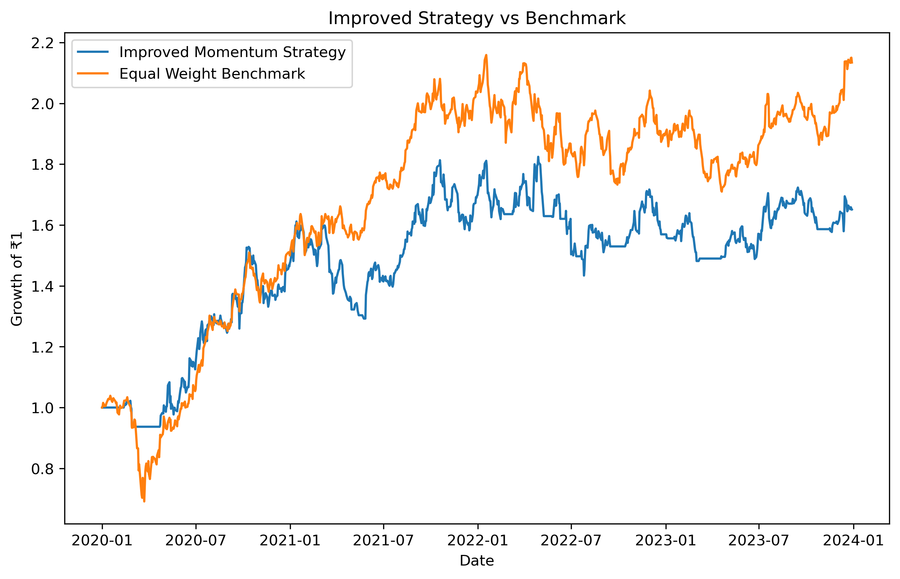

# Portfolio Optimization & Strategy Backtesting

A data-driven portfolio optimization and backtesting project built using Python.

---

## 🎯 Objective
To design and evaluate a data-driven portfolio strategy by combining 
risk-return optimization with momentum-based signals and backtesting.

---

## 📌 Description
This project analyzes stock market data and constructs optimal portfolios using Modern Portfolio Theory (MPT).

It evaluates risk-return trade-offs, simulates multiple portfolios, and identifies the most efficient portfolio using the Sharpe Ratio.  
Additionally, a momentum-based trading strategy is implemented and rigorously backtested against a benchmark.

---

## 📊 Features
- Data collection using yfinance  
- Return calculation using percentage change  
- Risk measurement using volatility  
- Portfolio simulation (1000+ portfolios)  
- Efficient Frontier visualization  
- Optimal portfolio selection (Sharpe Ratio)  
- Momentum-based strategy implementation  
- Backtesting against benchmark  

---

## 🛠 Tech Stack
- Python  
- Pandas  
- NumPy  
- Matplotlib  
- yfinance  

---

## ▶️ How to Run
1. Install dependencies:pip install -r requirements.txt
2. Open the notebook  
3. Run all cells  

---

## 📊 Sample Output

### Efficient Frontier

### Strategy vs Benchmark Performance

---

## 📈 Key Insight
The optimal portfolio is not the one with the highest return or lowest risk,  
but the one that maximizes risk-adjusted return (Sharpe Ratio).

---

## 📌 Results & Insights
- Portfolio optimization effectively captured the trade-off between risk and return  
- A momentum-based trading strategy was implemented using 30-day returns as a signal  
- The strategy was backtested against an equal-weight benchmark  
- Results showed that the strategy underperformed, indicating limited predictive power of the chosen momentum signal  
- This highlights the importance of rigorous backtesting and robust signal design in quantitative finance  

---

## ⚠️ Limitations
- Limited number of stocks used (small universe)  
- Single-factor strategy (momentum only)  
- No transaction cost modeling  

---

## 🚀 Future Work
- Expand the stock universe to improve diversification and signal effectiveness  
- Explore multi-factor strategies (momentum, volatility, value)  
- Incorporate machine learning models for return prediction  
- Build an interactive dashboard using Streamlit  

---

## 🧠 Key Learning
Not all strategies outperform the market.  
Systematic backtesting is essential to validate any investment approach before deployment.
